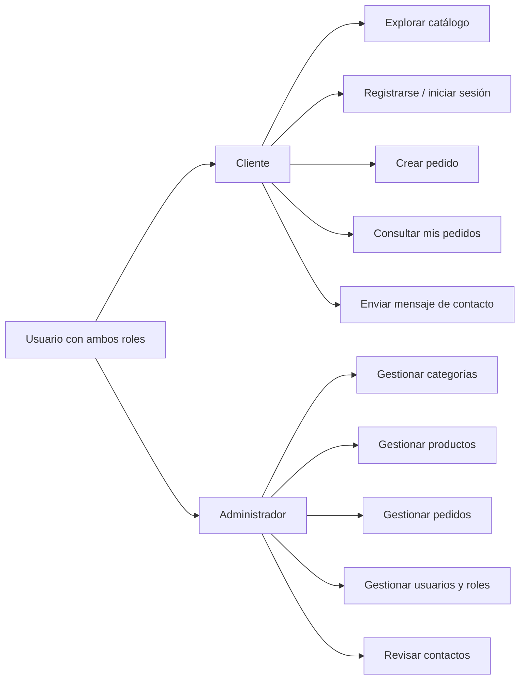
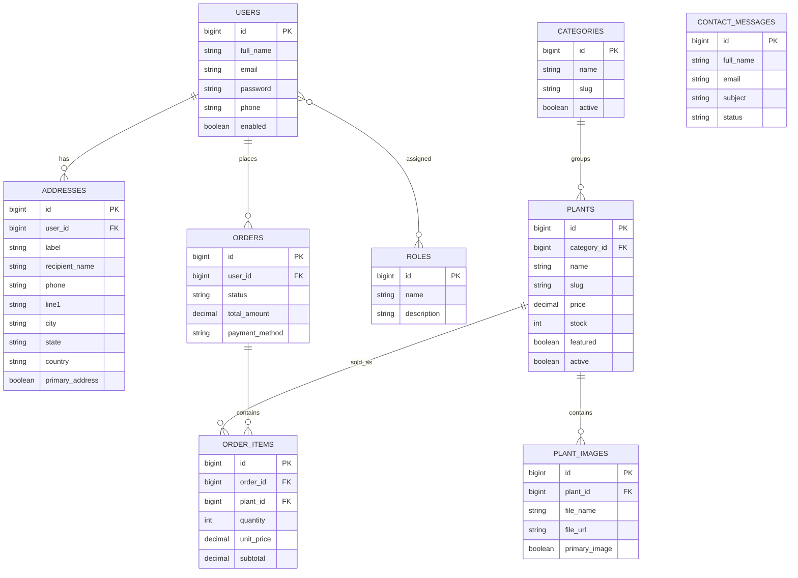

# Sistema de ventas de plantas online

## Roles y permisos

| Rol | Permisos principales |
| --- | --- |
| `ROLE_CUSTOMER` | Registrarse, iniciar sesión, ver catálogo, enviar mensajes de contacto, crear pedidos, ver sus pedidos y consultar perfil |
| `ROLE_ADMIN` | Todo lo anterior más CRUD de categorías, productos, imágenes, pedidos, usuarios y revisión de contactos |

Un usuario puede ser cliente y administrador al mismo tiempo, por eso `users` y `roles` usan una relación muchos a muchos.

## Diagrama de casos de uso

## Diagrama entidad relación

## Endpoints REST principales

- `POST /api/auth/register`
- `POST /api/auth/login`
- `GET /api/users/me`
- `GET /api/users`
- `PUT /api/users/{id}/roles`
- `GET /api/categories`
- `POST /api/categories`
- `PUT /api/categories/{id}`
- `DELETE /api/categories/{id}`
- `GET /api/plants`
- `GET /api/plants/admin`
- `GET /api/plants/{id}`
- `POST /api/plants` con `multipart/form-data`
- `PUT /api/plants/{id}` con `multipart/form-data`
- `DELETE /api/plants/{id}`
- `POST /api/orders`
- `GET /api/orders/me`
- `GET /api/orders`
- `PATCH /api/orders/{id}/status`
- `POST /api/contacts`
- `GET /api/contacts`
- `PATCH /api/contacts/{id}/status`
